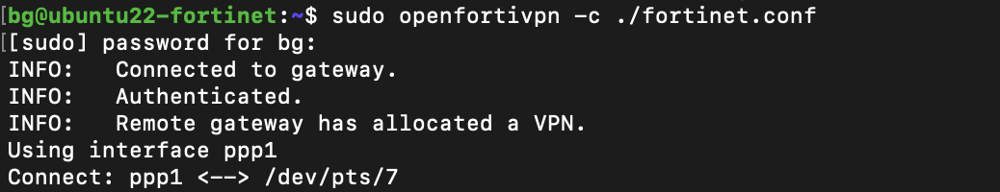

Description:
============

This is a tutorial and a script permitting to access Fortinet VPNs using the open source client instead of the proprietary one


Dependencies:
=============

* openssl command line tools:
```
sudo apt install openssl
```
* openfortivpn:
```
sudo apt update
sudo apt upgrade
sudo apt install openfortivpn
```
* Python3;
* The Python script present in this repository;


Configuration:
==============

* The Python script here will create the configuration file, syntax:
```
fortinet_configurator.py -i [ip] -p [port] -u [username]  > [configuration_file]
```
* Insert the password when requested;
* Example:
./fortinet_configurator.py -i 1.2.3.4 -p 5555 -u myname  >  fortinet.conf
* In the example, fortinet.conf will be created, It contains the configuration required by openfortivpn, you can check it using:
```
cat fortinet.conf
```

Connection:
===========

* Syntax:

```
  sudo openfortivpn -c [configuration_file]
```
* Using the file generated in the configuration example, we have:
```
  sudo openfortivpn -c ./fortinet.conf
```



